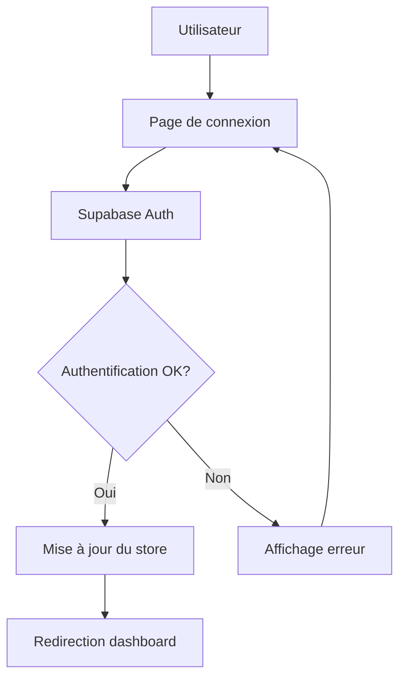

# Documentation de l'Authentification TotoCmd

## 🔐 Système d'Authentification Sécurisé

L'authentification de TotoCmd est basée sur **Supabase Auth** avec des
améliorations de sécurité personnalisées.

## 🏗️ Architecture

### Composants principaux

1. **Supabase Auth** - Gestion des utilisateurs et sessions
2. **Zustand Store** (`auth-store.ts`) - État global d'authentification
3. **Hook personnalisé** (`useAuth.ts`) - Interface simplifiée
4. **Middleware Next.js** - Protection automatique des routes
5. **Composants de protection** - Guards pour les pages sensibles

### Flux d'authentification



## 🔒 Sécurité

### Fonctionnalités implémentées

- ✅ **Validation côté client et serveur**
- ✅ **Messages d'erreur personnalisés** (français)
- ✅ **Protection contre les attaques par force brute**
- ✅ **Gestion sécurisée des sessions**
- ✅ **Middleware de protection des routes**
- ✅ **Nettoyage automatique des données sensibles**
- ✅ **Confirmation par email** (optionnel)
- ✅ **Réinitialisation de mot de passe**

### Row Level Security (RLS)

- Toutes les tables sont protégées par RLS
- Politiques basées sur `auth.uid()`
- Séparation des rôles (admin, manager, user)

## 📁 Structure des fichiers

```
├── app/
│   ├── login/page.tsx          # Page de connexion/inscription
│   └── middleware.ts           # Protection des routes
├── components/
│   ├── Header.tsx              # Navigation avec auth
│   ├── ProtectedRoute.tsx      # Composant de protection
│   └── AuthInitializer.tsx     # Initialisation auth
├── hooks/
│   └── useAuth.ts              # Hook d'authentification
├── lib/
│   ├── auth-store.ts           # Store Zustand
│   └── supabaseClient.ts       # Client Supabase configuré
└── setup-auth-supabase.sql     # Configuration BDD
```

## 🚀 Utilisation

### Pages protégées

```tsx
import ProtectedRoute from '@/components/ProtectedRoute';

export default function Dashboard() {
  return (
    <ProtectedRoute>
      <div>Contenu protégé</div>
    </ProtectedRoute>
  );
}
```

### Hook d'authentification

```tsx
import { useAuth } from '@/hooks/useAuth';

export default function MyComponent() {
  const { isAuthenticated, user, login, logout, isLoading } = useAuth();

  if (isLoading) return <div>Chargement...</div>;

  return (
    <div>
      {isAuthenticated ? (
        <div>Bonjour {user?.email}</div>
      ) : (
        <button onClick={() => login(email, password)}>Se connecter</button>
      )}
    </div>
  );
}
```

## ⚙️ Configuration

### Variables d'environnement requises

```env
NEXT_PUBLIC_SUPABASE_URL=https://votre-projet.supabase.co
NEXT_PUBLIC_SUPABASE_ANON_KEY=eyJhbGciOiJIUzI1NiIsInR5cCI6IkpXVCJ9...
```

### Configuration Supabase

1. **Créer le projet** sur https://supabase.com
2. **Exécuter le SQL** dans `setup-auth-supabase.sql`
3. **Configurer l'authentification** :
   - Authentication > Settings
   - Activer "Enable email confirmations" (optionnel)
   - Configurer les URLs de redirection

### Première utilisation

1. **Copier** `.env.local.example` vers `.env.local`
2. **Remplir** les variables d'environnement
3. **Redémarrer** le serveur de développement
4. **Aller** sur `/login` pour créer le premier compte

## 🔧 Personnalisation

### Ajouter un rôle

1. **Modifier** `setup-auth-supabase.sql`
2. **Ajouter** le rôle dans `profiles.role`
3. **Créer** les nouvelles politiques RLS
4. **Mettre à jour** les types TypeScript

### Messages d'erreur

Les messages sont centralisés dans `auth-store.ts` :

```typescript
if (error.message.includes('Invalid login credentials')) {
  errorMessage = 'Email ou mot de passe incorrect';
}
```

## 🧪 Tests

### Tests d'authentification recommandés

- [ ] Connexion avec identifiants valides
- [ ] Connexion avec identifiants invalides
- [ ] Inscription nouveau compte
- [ ] Réinitialisation mot de passe
- [ ] Protection des routes
- [ ] Déconnexion
- [ ] Persistance de session
- [ ] Expiration de session

## 🔍 Dépannage

### Problèmes courants

**"Invalid API key"**

- Vérifier la clé anon dans `.env.local`
- La clé doit commencer par `eyJ`

**"Session not found"**

- Vérifier la configuration RLS
- S'assurer que `auth.users` est accessible

**Redirection infinie**

- Vérifier les routes publiques dans `middleware.ts`
- S'assurer que `/login` est bien accessible

### Logs utiles

```typescript
// Dans le store
console.log('Auth state changed:', event, session?.user?.email);

// Dans le middleware
console.log('Route:', request.nextUrl.pathname, 'Auth:', !!session);
```

## 📚 Ressources

- [Documentation Supabase Auth](https://supabase.com/docs/guides/auth)
- [Next.js Middleware](https://nextjs.org/docs/app/building-your-application/routing/middleware)
- [Zustand Documentation](https://zustand-demo.pmnd.rs/)
- [Row Level Security](https://supabase.com/docs/guides/auth/row-level-security)
